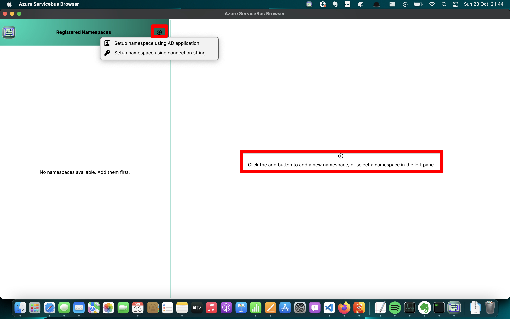

# azure-servicebus-browser
## Known issues
Unfortunately, the Azure.Messaging.ServiceBus SDK does not support server-side filtering. Therefore, filtering on queue / topic / subscription names may lead to inconsistent results in the application for now. See [this topic on stack overflow](https://stackoverflow.com/questions/77697436/filtering-topics-queues-subscriptions-with-azure-messaging-servicebus)
## Introduction
Azure Servicebus Browser is a basic tool that supports management and inspection of some of the most common resources of [Azure service bus](https://azure.microsoft.com/en-us/products/service-bus/). Today, it supports queues, topics and subscriptions, with inspection and replay of messages etc. By no means it is a *complete* tool, although it fulfills most if not all of my needs for day to day tasks, because these are the resources we use in my current projects.

When using Windows OS, the obvious go-to tool for years has been and remains to be [Service Bus Explorer](https://github.com/paolosalvatori/ServiceBusExplorer) I believe. It is a very complete tool, open source and free, with support for a lot of resources that my tool here does not support. There are some alternative tools listed on the Service bus explorer github as well, most of them with a paying option / free trial, ....

The last couple of years, more and more dotnet developers such as myself switched to MacOS as their main OS. I like to avoid the need to start my Windows VM in Parallels, only to use a particular tool, because the fans of my machine go in overdrive when I use the virtual machine :-). Unfortunately, Service bus explorer is Windows only. 

At the time I started working on this tool, I was curious about the current state of cross-platform UI frameworks, and figured I could use this tool to learn some [Avalonia](https://avaloniaui.net). So here we are :-).

Anyway, this is the initial state when you start the browser for the first time:

You can register a service bus namespace using a connection string or an Azure AD application. The following screenshot shows the registration form for a connection string setup:

When saved, the namespace is added to the left pane, which is a tree view which allows you to organize your namespace in a tree view. The key icon in front of the namespace indicates that this is a namespace registered with a connection string:

You can change the name of the resource at any time by double-clicking the name in the header section of the namespace overview, once the resource is selected. You can change the name of a folder in the left treeview by double-clicking the folder.

Upon selection of a namespace in the left pane, the right pane displays a tree view with the resources defined in the namespace (queues and topics at the time of writing). 

Queues, topics and subscriptions are loaded into the overview in groups of max 100 resources. If there are more resources, a "load more" leaf will be shown in the tree, which loads the next batch of resources upon click.

You can add new resources by clicking on the plus icon at the right of the resource type nodes in the tree. You also can edit existing resources, with a click on the edit icon on the right of the resource.

Editing of an existing queue as an example:

Double clicking a resource in the namespace overview opens up a window with a detail of the namespace resource:

Selecting a resource in this window, shows the properties of the resource:

E.g. in case of a subscription on this topic, you can inspect the subscription rules:

In the namespaces overview startup view, you can change the name of a namespace by double clicking the title of the right pane after selecting the namespace. 
You can change the name of a folder in the left pane also by double clicking. 
Dragging a namespace in the left pane treeview over another namespace creates a folder holding the two namespaces, dragging and dropping a namespace over an existing folder adds it to that folder. Doing this move with a folder, moves the dragged folder to the target folder.
